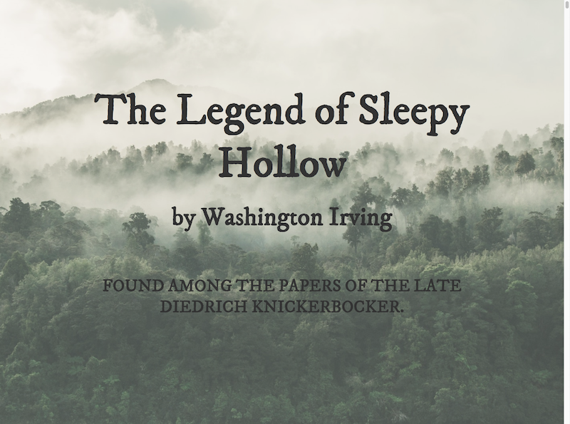
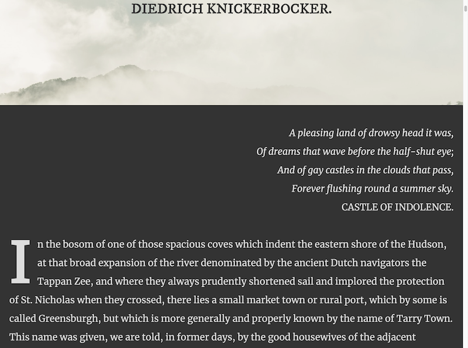
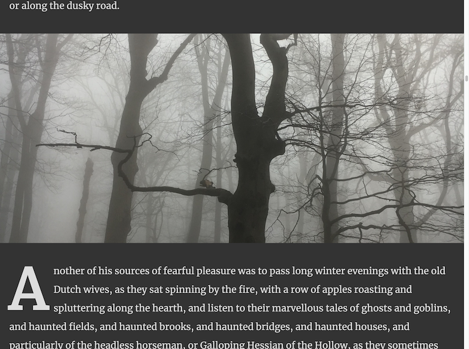
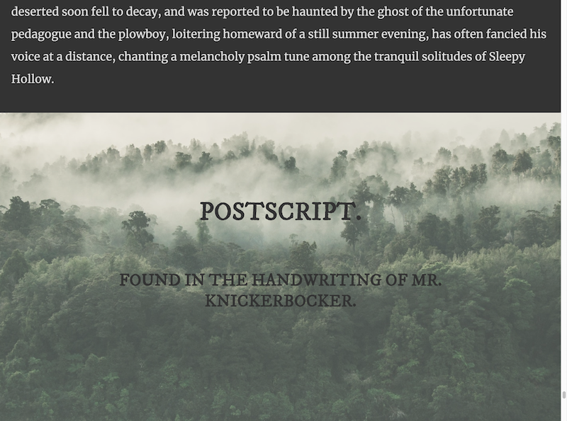
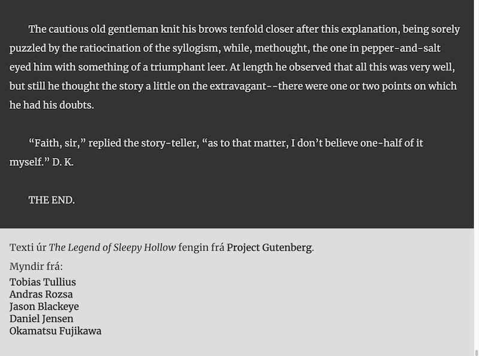
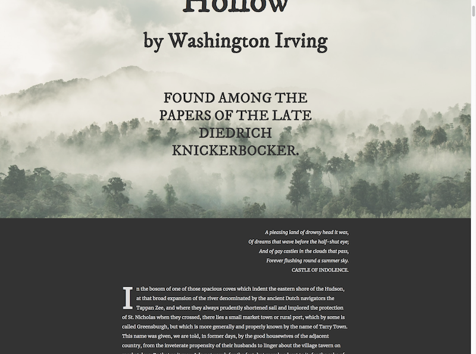

# Verkefni 4

Útfæra skal síðu með fyrsta hluta sögunnar _The Legend of Sleepy Hollow_.

## Lýsing

Gefið er HTML skjal með öllum texta ásamt CSS skrá sem _resettar_ margin og padding á öllum elementum ásamt því að setja `box-sizing: border-box;` á öll element.

Sækja þarf tvær leturgerðir á Google Font og tengja við verkefni:

* `IM Fell DW Pica`, regular
* `Merriweather`, regular, regular italic og bold 700

Gefin er fyrirmynd sem sýnir fyrsta part af verkefni, part í miðju og neðsta part:

[Vídeó af hegðun sýnilausnar](utlit/layout.mp4)

Bæta þarf við viðeigandi elementum í HTML til að geta stílað skv. forskrift, leitast skal við að nota merkingafræðileg element (t.d. `<header>` og `<footer>`). Ekki er leyfilegt að setja myndir inn með ``.

Allar myndir skulu fylla út í alla breidd á viewport, sama hver hún er, sjá skjáskot þar sem búið er að zooma í 50% stærð:

Aðeins er leyfilegt að setja myndir inn með CSS.

### Útlit

Leturstærðir skulu skilgreindar með `em` eða `rem`, leyfilegt er að nota aðrar einingar á öðrum stærðum en notast skal við hlutfallslegar stærðir nema góð ástæða til annars.

Grunn leturstærð í fyrirmynd er `28px`.

Meginmál notar `Merriweather`. Fyrirsagnir nota `IM Fell DW Pica`.

Svartur litur er `#333`, hvítur litur er `#ddd`.

Fyrirmynd notar eftirfarandi bil:

* `28px` fyrir minni bil
* `56px` fyrir stærri bil
* `28px` padding er notað til að texti leggist ekki utan í viewport í minni stærðum, sjá mynd að neðan

Fyrirsagnir sem liggja ofan á texta skulu hafa _protection_ á bakvið sig sem fara yfir alla myndina. Þetta _protection_ skal vera 80% gegnsætt og alveg hvítt á litinn.

Þar sem texti er allur í hástöfum á ekki að breyta texta í HTML skjali heldur nota CSS.

### Haus og „haus“ í fæti

Fyllir út í allan skjá (allt _viewport_) bæði á breidd og hæð. Setur fasta mynd (`img/trees.jpg`) sem fyllir út í allt element. Bil að ofan er 20% af hæð _viewport_. Notar minni bil á milli fyrstu og annarar fyrirsagnar en á milli annarar fyrirsagnar og texta er bil sem byggir á einhvern hátt á breidd eða hæð viewport, sama á við um leturstærðir. Þessar stærðir þurfa ekki þarf að vera nákvæmlega eins og í sýnilausn en í henni er hegðun eftirfarandi:

Hámarksbreidd á texta í haus er `1120px`.

### Meginmál

Hámarksbreidd meginmáls er `1400px` og skal það vera miðjusett.

Texti í tilvísun er skáletraður en vitnun ekki.

Texti meginmáls er í grunnstærð með línuhæð 2.

Fyrsti stafur í fyrstu málsgrein á eftir mynd skal stækkaður upp í að fara yfir þrjú línubil og vera feitletraður.

### Myndir í meginmáli

Í gefnu HTML eru á fjórum stöðum `
` sem brýtur upp texta. Þau skal stíla til þannig að þau fylli upp í 60% af hæð viewports og alla breidd þess með fastar myndir sem fylla upp í allt element. Myndir eru í röð:

* `img/tree-fog.jpg`
* `img/castle.jpg`
* `img/hands.jpg`
* `img/moon.jpg`

### Fótur

Fótur hefur hvítan bakgrunn með svörtum texta. Hámarksbreidd efnis er `1400px`. Stíla skal til þau element sem eru í gefnu HTML eftir fyrirmynd, ekki ætti að breyta HTML.

### Takmarkanir

Aðeins er leyfilegt að nota eftirfarandi yfirlýsingar í CSS:

* `background-*`
* `border`
* `bottom`
* `box-sizing`
* `color`
* `float`
* `font-*`
* `height`
* `left`
* `line-height`
* `margin-*`
* `max-height`
* `max-width`
* `padding-*`
* `position`
* `right`
* `text-*`
* `top`
* `width`
* `z-index`

Leyfilegt er að nota alla selectora.

CSS skal vera án villna og viðvarana þegar keyrt í gegnum https://jigsaw.w3.org/css-validator/

## Mat

* 20% – Snyrtilega uppsett, merkingarfræðilegt og gilt HTML
* 20% – Snyrtilega uppsett, gilt CSS sem aðeins notar leyfileg eigindi
* 30% – Haus og fótur útfærðir eftir forskrift
* 30% – Meginmál útfært eftir forskrift

## Sett fyrir

Verkefni sett fyrir í fyrirlestri mánudaginn 17. september 2018.

## Skil

Skila skal undir „Verkefni og hlutaprófa“ á Uglu í seinasta lagi fyrir lok dags þriðjudaginn 25. september 2018.

Skilaboð skulu innihalda slóð á verkefni ásamt zip skjali með lausn sem heitir `verkefni4-<notendanafn>.zip`, t.d. `verkefni4-osk.zip`.

## Einkunn

Sett verða fyrir tíu minni verkefni þar sem átta bestu gilda 3,5% hvert, samtals 28% af lokaeinkunn.

Sett verða fyrir tvö hópverkefni þar sem hvort um sig gildir 11%, samtals 22% af lokaeinkunn.

---

> Útgáfa 0.1
